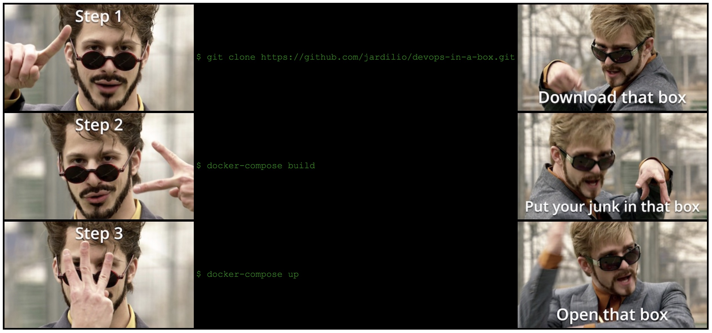

# Overview

"DevOps in a Box" - A complete turn-key solution for accelerated DevOps toolchain deployment

* [Jenkins](./jenkins) - Solution for continuous integration
* [GitLab](./gitlab) - Solution for code repository, review and task management
* [Rocket.Chat](./rocketchat) - Solution for team communications and chatbots
* [Artifactory](./artifactory) - Solution for managing build artifacts and dependencies
* [SonarQube](./sonarqube) - Solution for managing code quality
* [GoCD](./gocd) - Solution for continuous deployment
* [OpenLDAP](./openldap) - Solution for single LDAP authentication for all above services
* [NGINX](./proxy) - Solution for subdomain reverse proxy for all above services

*NOTE* More services in progress including: prometheus, grafana, ansible...

See each of the solution providers above for more information about the implementation and configuration

# Getting Started
<!--
<table style="background: black; color: #008000; font-family: 'Lucida Console', 'Courier New';">
    <tbody>
        <tr>
            <td></td>
            <td>$ git clone https://github.com/jardilio/devops-in-a-box.git</td>
            <td></td>
        </tr>
        <tr>
            <td></td>
            <td>$ docker-compose build</td>
            <td></td>
        </tr>
        <tr>
            <td></td>
            <td>$ docker-compose up</td>
            <td></td>
        </tr>
    </tbody>
</table>
-->


And thats the way you do it!

This may take a few minutes to download and build the dependencies the first time. Once complete, each
of the services should be running as configured in [docker-compose.yml](./docker-compose.yml) and accessible
at [http://localhost](http://localhost).

Note that there are many services and volumes that must initialize, it may take 
a bit after the initial build for all services to become available, check your console. You will get 502
errors from the proxy server until the service is ready and reachable.

If you want to speed up this process for testing and only work with a single named service, you can 
reduce the total number of loaded services and only load it and its dependencies, example:

```
docker-compose up jenkins
```

The [docker-compose.yml](./docker-compose.yml) file makes use of environment variables which
are defined in [.env](./.env) and is read in automatically by `docker-compose` when executed. 
These settings are also used to generate k8s configurations and should be set for the 
target environment you will deploy to.

# Building and Deploying

* Set `DOCKER_IMAGE_TAG` with a version you want to tag the new build as (default is latest). Optionally you may want to set or change 
other values in [.env](./.env) as this will generate the defaults for k8s configurations.
* Log in with `docker login` to an account that has access to the destination repos specified by the image names in [docker-compose.yml](./docker-compose.yml) 
* Build the images using `docker-compose build`
* Push the images using `docker-compose push`

```
export DOCKER_IMAGE_TAG=2.0
docker login
docker-compose build
docker-compose push
```

Once the images have been built and pushed to the repos, you can deploy using one of the helper services in [deploy](./deploy). Make
sure that [.env](./.env) is updated for the target environment, this is used to build the default configuration files for kubernetes.

```
cd deploy
docker-compose run gcp
```